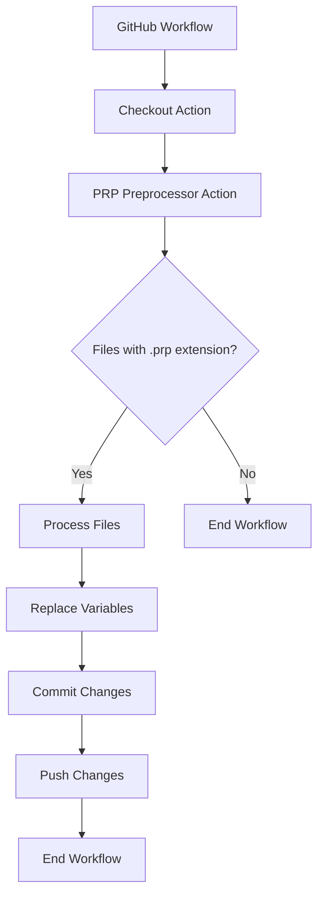

<div align="center">
<a href="https://github.com/CIFriends">
    
</a>

# {_ prpTitle _}

_A versatile GitHub Action that enables variable replacement in files using a simple_ `{_ variable _}` _syntax._


[](https://sonarcloud.io/summary/new_code?id=CIFriends_prp-preprocessor)
[](https://sonarcloud.io/summary/new_code?id=CIFriends_prp-preprocessor)
</div>

{_ alertMessage _}
>
> Read our [docs](https://github.com/CIFriends/prp-preprocessor/wiki)

Are you tired of updating things like README version references, documentation, configuration files, and more on every
release?

_PRP automates this for you!
With PRP, you can focus on your code while it takes care of the tedious updates._

## Installation

> [!TIP]
> Reference: [How to Use](https://github.com/CIFriends/prp-preprocessor/wiki/How-to-Use)

To install the PRP Preprocessor, you can add it as a step in your [GitHub Actions](https://github.com/features/actions)
workflow.
Here's an example of how to
use it:

```yml
steps:
  - name: Checkout # Checkout the repository
    uses: actions/checkout@v4
    # with:
    #  ref: "main" # uncomment this line to check out a specific branch
  - name: PRP Preprocessor
    uses: CIFriends/prp-preprocessor@{_currentVersion_}
    env:
      exampleVar: "Hello, World! This is an example variable."
```

<details>
<summary>Workflow Diagram</summary>



</details>

## Usage

After installing the PRP Preprocessor, you can use it to replace variables in your `.prp.<any>` files.
Here's an example of how to
use it:

<details>
<summary>Using a variable in a file</summary>

`example.prp.json`

```json
{
  "name": "{_ exampleVar _}"
}
```

Output:

`example.json`

```json
{
  "name": "Hello, World! This is an example variable."
}
```

</details>

## Inputs

You can find the list of inputs and their descriptions in the [action.yml](action.yml) file,
or you can read the [docs](https://github.com/CIFriends/prp-preprocessor/wiki/Inputs).

## Contributing

We welcome contributions to this project! Please read our [Contributing Guide](CONTRIBUTING.md) for more information on
how to contribute.

If you've found this project useful, please consider giving it a ⭐ on GitHub.
This helps to spread the awareness of the
project and is a great way to show your support!

## License

This project is licensed under the Apache-2.0 License.
